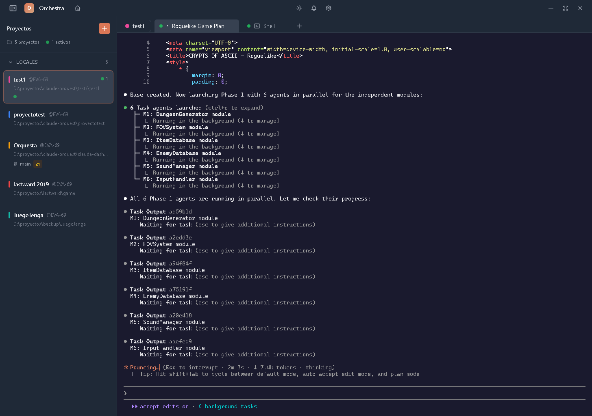
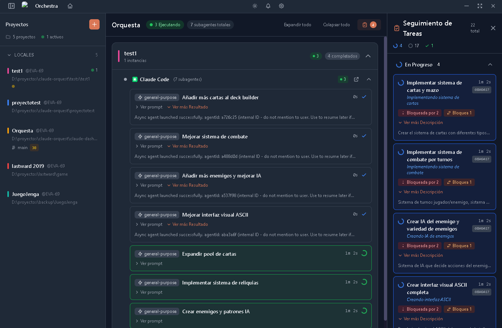

# Orchestra

A desktop application for managing multiple Claude Code CLI instances across different projects with real-time visualization.

> **Note:** Orchestra is an independent, community-developed project. It is not affiliated with, endorsed by, or officially connected to Anthropic in any way.




## Why Orchestra?

Managing multiple Claude Code sessions across different projects can quickly become overwhelming. Orchestra provides a unified control center to spawn, monitor, and interact with multiple Claude instances—all from a single interface.

**The Vision**: Transform how teams and individuals work with Claude Code by enabling centralized orchestration, real-time collaboration, and remote access to AI-powered development sessions.

## Use Cases

### Team Collaboration
Multiple developers can connect to shared Claude instances running on a central server. Watch your teammate's Claude session tackle a complex refactoring in real-time, or collaborate on debugging sessions where everyone can see Claude's reasoning and tool executions as they happen.

### Centralized Development Infrastructure
Set up a dedicated machine (or cluster of VMs) with your projects pre-configured and Orchestra running. Team members connect remotely from their workstations to launch and monitor Claude sessions without needing local setup. Ideal for:
- Development labs with standardized environments
- Enterprise teams with centralized tooling
- Training environments where instructors monitor multiple sessions

### Remote Personal Monitoring
Check on your long-running Claude sessions from your phone while away from your desk. Whether you're waiting for a complex migration to complete or monitoring a batch refactoring job, remote access keeps you informed. Configure proper network routing (VPN, tunnels, or direct access) and monitor your development sessions from anywhere.

### Multi-Project Oversight
When working on multiple projects simultaneously, Orchestra gives you a bird's-eye view of all your Claude sessions. Quickly switch context, compare progress across projects, and manage resources efficiently.

## Remote Access

Orchestra includes a standalone web client that connects via WebSocket, enabling browser-based access from any device. The built-in authentication system (JWT-based) ensures secure remote connections to your Orchestra instance.

## Features

- **Multi-Project Management**: Organize and manage multiple projects with Claude instances
- **Real-Time Terminal**: Full xterm.js terminal emulation for Claude CLI
- **Structured View**: Parse and display Claude's stream-json output as cards
- **Instance Status**: Live status indicators (running, completed, error, etc.)
- **Configuration Viewer**: View MCP servers, tools, and hooks
- **Cluster Mode**: Multi-node architecture with primary/secondary roles
- **Remote Access**: WebSocket-based access with JWT authentication
- **Permission System**: Rule-based permission management with audit logging
- **Metrics & Analytics**: Tool usage, session tracking, and cost metrics
- **Web Proxy & DevTools**: Preview local dev servers with console capture (in progress)

## Feature Availability by Client

| Feature | App (Electron) | CLI (Headless) | Web | TUI | Mobile |
|---------|:--------------:|:--------------:|:---:|:---:|:------:|
| **Instance Management** |
| Create/spawn instances | ✅ | ✅ | ✅ | 📋 | ✅ |
| Kill instances | ✅ | ✅ | ✅ | 📋 | ✅ |
| Monitor output | ✅ | ✅ | ✅ | 📋 | ✅ |
| Shell instances | ✅ | ❌ | ❌ | ❌ | ❌ |
| Split terminal view | ✅ | ❌ | ❌ | ❌ | ❌ |
| **Cluster & Remote** |
| Act as primary node | ✅ | ✅ | ❌ | ❌ | ❌ |
| Connect to remote cluster | ✅ | ❌ | ✅ | 📋 | ✅ |
| Multi-node clustering | ✅ | ✅ | ❌ | ❌ | ❌ |
| Global state sync | ✅ | ✅ | ✅ | 📋 | ✅ |
| **Terminal & Views** |
| Full xterm.js terminal | ✅ | ❌ | ✅ | ❌ | ⚠️ |
| Structured card view | ✅ | ❌ | ✅ | 📋 | ✅ |
| Interactive input | ✅ | ❌ | ✅ | 📋 | ⚠️ |
| Permission prompts | ✅ | ❌ | ✅ | 📋 | ✅ |
| **Configuration** |
| Project management | ✅ | ✅ | ✅ | 📋 | ✅ |
| Security settings | ✅ | ✅ | ❌ | ❌ | ❌ |
| Cluster configuration | ✅ | ✅ | ❌ | ❌ | ❌ |
| Permission rules | ✅ | ✅ | ❌ | ❌ | ❌ |
| **Advanced Features** |
| Metrics & analytics | ✅ | ✅ | ✅ | ❌ | ✅ |
| Audit logging | ✅ | ✅ | ❌ | ❌ | ❌ |
| Git status integration | ✅ | ✅ | ✅ | ❌ | ✅ |
| Notifications | ✅ | ✅ | ✅ | ❌ | ✅ |
| Web proxy preview | ✅ | 🚧 | ❌ | ❌ | ❌ |
| DevTools inspector | ✅ | 🚧 | ❌ | ❌ | ❌ |
| Subagent tracking | ✅ | ✅ | ✅ | 📋 | ✅ |
| Keyboard shortcuts | ✅ | ❌ | ✅ | 📋 | ❌ |

**Legend:**
- ✅ Available
- ⚠️ Limited functionality
- 🚧 In development
- 📋 Planned (roadmap)
- ❌ Not available / Not applicable

**Notes:**
- **App (Electron)**: Full-featured desktop application with all capabilities
- **CLI (Headless)**: Server-only mode for deployment without GUI, ideal for running as a cluster primary on servers
- **Web**: Browser-based remote client connecting via WebSocket, view-only for configuration
- **TUI**: Terminal UI interface (in development), will provide monitoring in terminal environments
- **Mobile**: Web client accessed from mobile browsers, limited interaction due to screen size and touch input

## Tech Stack

- **Electron** - Desktop application framework
- **React + TypeScript** - Frontend framework
- **Tailwind CSS** - Styling
- **Zustand** - State management
- **better-sqlite3** - Local database
- **xterm.js** - Terminal emulation
- **node-pty** - Pseudo-terminal spawning
- **Socket.io** - Real-time WebSocket communication
- **i18next** - Internationalization
- **Vite** - Build tooling

## Prerequisites

- Node.js 20+
- npm 9+
- Claude CLI installed and configured

### Linux-Specific Requirements

**For users (installing from AppImage/deb):**
- Claude CLI installed and available in PATH
- FUSE for AppImage:
  ```bash
  # Ubuntu 22.04+
  sudo apt install libfuse2

  # Fedora
  sudo dnf install fuse

  # Arch Linux
  sudo pacman -S fuse2
  ```
- If you get a SUID sandbox error, either run with `--no-sandbox`:
  ```bash
  orchestra --no-sandbox
  ```
  Or enable unprivileged user namespaces (recommended):
  ```bash
  # Temporary
  sudo sysctl -w kernel.unprivileged_userns_clone=1

  # Permanent
  echo 'kernel.unprivileged_userns_clone=1' | sudo tee /etc/sysctl.d/userns.conf
  ```

**For developers (building from source):**

Ubuntu/Debian:
```bash
sudo apt-get install build-essential python3 libsecret-1-dev
```

Fedora:
```bash
sudo dnf groupinstall "Development Tools"
sudo dnf install libsecret-devel
```

Arch Linux:
```bash
sudo pacman -S base-devel libsecret
```

## Quick Install

**Linux/macOS:**
```bash
curl -fsSL https://raw.githubusercontent.com/endikavi/claude-code-orchestra/main/install.sh | bash
```

Or with wget:
```bash
wget -qO- https://raw.githubusercontent.com/endikavi/claude-code-orchestra/main/install.sh | bash
```

**Windows:**
Download the installer from [GitHub Releases](https://github.com/endikavi/claude-code-orchestra/releases).

## Updating

**In-app update:**
Orchestra will automatically check for updates on startup and notify you when a new version is available. You can also manually check for updates in Settings > Updates.

**Linux/macOS (CLI):**
```bash
# Check for updates
curl -fsSL https://raw.githubusercontent.com/endikavi/claude-code-orchestra/main/update.sh | bash -s -- --check

# Update to latest version
curl -fsSL https://raw.githubusercontent.com/endikavi/claude-code-orchestra/main/update.sh | bash
```

**Windows:**
Download the latest installer from [GitHub Releases](https://github.com/endikavi/claude-code-orchestra/releases) and run it.

## Installation (from source)

```bash
# Clone the repository
git clone https://github.com/endikavi/claude-code-orchestra.git
cd claude-code-orchestra

# Install dependencies
npm install

# Start development server (full Electron app)
npm run electron:dev
```

## Development

```bash
# Run full Electron app with hot reload (recommended)
npm run electron:dev

# Vite-only development (web preview, no Electron)
npm run dev

# Type check
npm run typecheck

# Lint and format
npm run lint
npm run format

# Run tests
npm run test:run

# Build for production
npm run build
```

## Building for Distribution

```bash
# Build for current platform
npm run electron:build

# Build for specific platforms
npm run electron:build:linux   # AppImage + deb
npm run electron:build:win     # NSIS installer
npm run electron:build:mac     # DMG

# Rebuild native modules (if needed after npm install)
npm run rebuild
```

This will create installers in the `release` directory:
- Windows: NSIS installer
- macOS: DMG
- Linux: AppImage and .deb package

## Project Structure

```
claude-code-orchestra/
├── src/
│   ├── main/           # Electron main process
│   │   ├── services/   # ProcessManager, DataStore, etc.
│   │   ├── ipc/        # IPC handlers and channels
│   │   ├── cli/        # Headless CLI entry point
│   │   └── utils/      # Utility functions
│   ├── renderer/       # React frontend
│   │   ├── components/ # UI components
│   │   ├── stores/     # Zustand stores
│   │   ├── hooks/      # React hooks
│   │   ├── contexts/   # React contexts
│   │   ├── i18n/       # Internationalization
│   │   ├── types/      # Renderer-specific types
│   │   ├── utils/      # Utility functions
│   │   └── styles/     # CSS files
│   ├── shared/         # Shared types and utilities
│   └── web/            # Standalone web client
├── docs/               # Documentation
└── resources/          # Icons and assets
```

## Keyboard Shortcuts

| Shortcut | Action |
|----------|--------|
| `Ctrl/Cmd+N` | New project |
| `Ctrl/Cmd+T` | New instance |
| `Ctrl/Cmd+W` | Close instance |
| `Ctrl/Cmd+Tab` | Next tab |
| `Ctrl/Cmd+Shift+Tab` | Previous tab |

## Configuration

Orchestra reads configuration from:
- Global: `~/.claude.json` or `~/.claude/settings.json`
- Project: `<project>/.claude/settings.json`

## Documentation

- [Architecture](./docs/architecture.md)
- [Features](./docs/features.md)
- [Services Overview](./docs/services-overview.md)
- [State Management](./docs/state-management.md)
- [IPC Channels](./docs/ipc-channels.md)
- [Database Schema](./docs/database-schema.md)
- [Headless/Server Deployment](./docs/headless-deployment.md)
- [Remote Access](./docs/remote-access.md)
- [Web Access Guide](./docs/web-access-guide.md)
- [Security Model](./docs/security-model.md)
- [Testing Guide](./docs/testing-guide.md)
- [Roadmap](./docs/roadmap.md)

## Reporting Issues

Found a bug or have a feature request? Please check the [existing issues](https://github.com/endikavi/claude-code-orchestra/issues) first, then open a new issue with:

- **Bug reports**: Steps to reproduce, expected vs actual behavior, OS/version info
- **Feature requests**: Clear description of the feature and its use case

## Questions and Support

- Open an issue with the `question` label for general questions
- Check the [documentation](./docs/) for detailed guides

## License

AGPL-3.0 - See [LICENSE](./LICENSE) for details.

## Contributing

Contributions are welcome! Please read our [contributing guidelines](./CONTRIBUTING.md) before submitting PRs.
